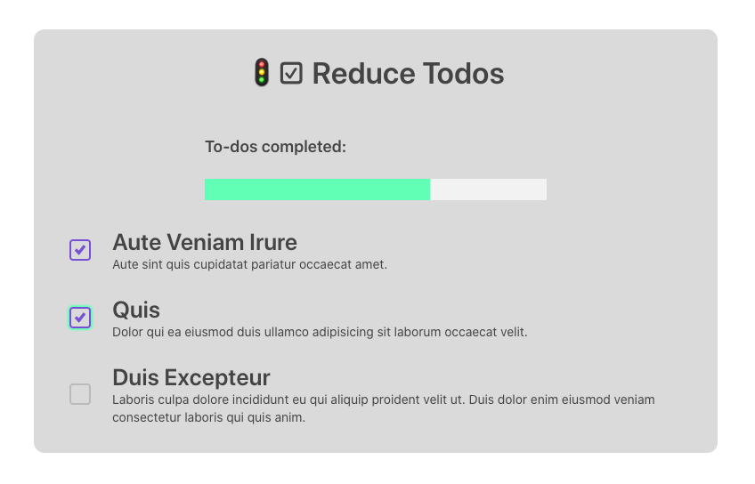

# 🚦☑️ Reduce Todos

A Todo app that uses React Hooks, particularly **useReducer** and **useContext**, to achieve a stateful pattern similar to Redux. The pattern is inspired by Harry Wolff's article **[How To useContext With useReducer
](https://hswolff.com/blog/how-to-usecontext-with-usereducer/)**

## 🥅 App Goals (WIP)
Application should be able to:
- Display to-do items with a name and a description
- Check off to-do items with a "completed" state

## 📚 Tech Stack
Technologies used to achieve app's goals:
- React (via Create React App CLI)
- [Grommet](https://v2.grommet.io/) (for pre-fabricated styled components)

## 📸 Screenshot
Screenshot of the local application running with 2/3 to-dos checked:
